# 開發基本準則:
## 前言: 
## 一個完整的開發過程需要有一個規範，來讓大家遵循，下面介紹的項目，請加入專案內，且每一個項目裡都有一個參考，都可以自己多找幾篇文章來看，這邊只提供一篇當參考。
## 這一篇總共會介紹這幾項規範的tool:
>1. 安裝visual studio code
>2. 安裝nodejs
>3. 建立git repository
>4. npm套件管理(也可使用yarn)
>5. 前端webpack, babel專案建置
>6. 使用visual studio code開發，如何debug(分前後端)，以及使用apidoc來讓前後端有個溝通介面
>7. 使用ESLint來管理coding style
>8. 請使用docker作為release的工具
>9. nexe(非必須，視專案用途)
>10. use jest to do unit test
>11. auto test(待補 maybe selenium)
>12. 結合git、docker、unit test來做CI/CD
>13. typescript & typeorm

 

## 1. 安裝visual studio code 
參考:
 
<<a href="https://ephrain.net/vscode-%E5%9C%A8-centos-mac-windows-%E4%B8%8A%E5%AE%89%E8%A3%9D-visual-studio-code/" target="_blank">安裝visual studio code</a>>

## 2. 安裝nodejs
參考:
 
<<a href="https://blog.gtwang.org/web-development/install-node-js-in-windows-mac-os-x-linux/" target="_blank">安裝nodejs</a>>

## 3. 建立git repository
參考:
 
git介紹:<<a href="http://gogojimmy.net/2012/01/17/how-to-use-git-1-git-basic/" target="_blank">git教學</a>>，看完教學後，接著做底下動作:
>a. <a href="https://gitlab.devpack.cc/users/sign_in" target="_blank">公司git</a>

>b. 帳號密碼: 進入上面網頁後，可以自訂，也可以使用OA筆電的帳密
    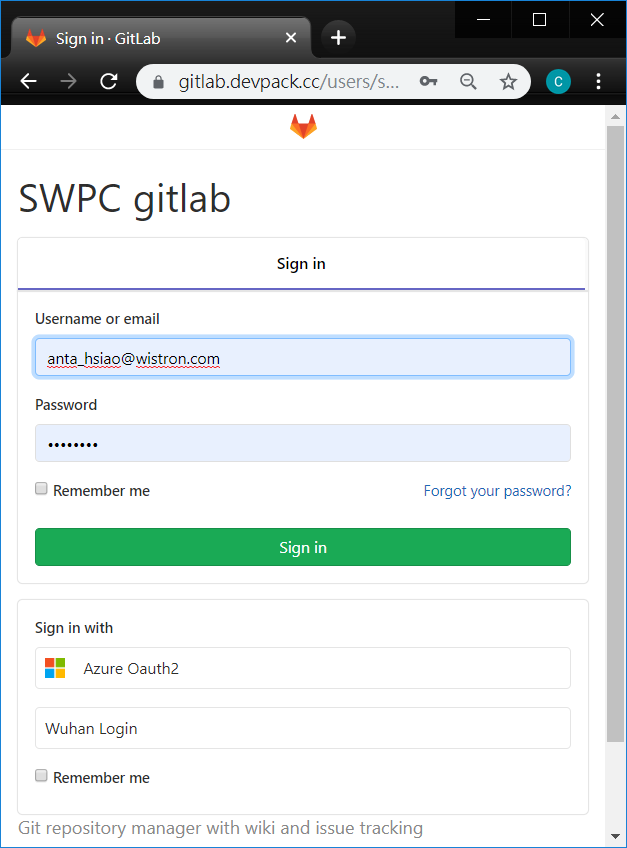

>c. 進入網站後，可以點選New project來建立repository，建完後，進入project取得clone url(比如:https://gitlab.devpack.cc/Anta_Hsiao/document.git)
 
>New project:
    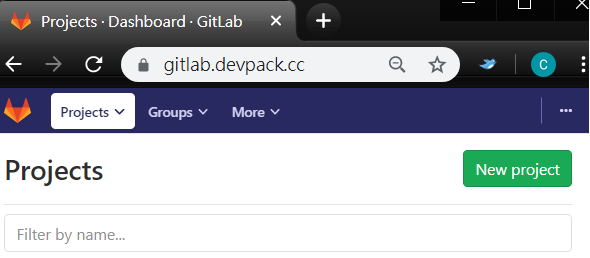
 
>Clone url:
    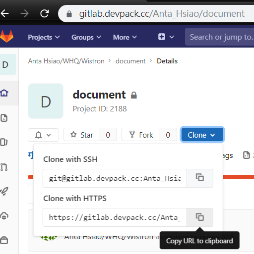

>d.  在local端安裝(<a href="https://gitforwindows.org/" target="_blank">git</a>)，網路上有很多有GUI的git，可自行搜尋並使用，底下皆使用git bash寫範例

>e.  打開git bash，如果您是使用windows，可以先看一下這一篇 <a href="https://blog.techbridge.cc/2017/12/23/linux-commnd-line-tutorial/" target="_blank">linux 基本指令</a>

>f. 接著請輸入以下指令，會要求你輸入帳號密碼(請使用b步驟的帳號密碼):

>  <pre><code>git clone https://gitlab.devpack.cc/Anta_Hsiao/document.git</code></pre>
>g. clone完後，會有一個document的資料夾，即可以用第七點的vs code打開此資料夾，來做開發
  
 

## 4. npm套件管理(也可使用yarn)
參考:
 
<<a href="https://medium.com/html-test/%E5%BE%9E%E9%9B%B6%E9%96%8B%E5%A7%8B-%E4%BD%BF%E7%94%A8npm%E5%A5%97%E4%BB%B6-317beefdf182" target="_blank">使用npm管理套件</a>>

<<a href="https://andyyou.github.io/2016/10/12/new-package-manager-javascript-yarn/" target="_blank">使用yarn管理套件</a>>

>a. npm init會幫忙建立package.json，而package.json是用來管理各個套件版本之間的相依性，而在多人開發的時候，不會因為安裝的套件不同，而有不同的結果，導致RD間跑一樣的程式卻有不同結果的誤會^^，當測試完一個module是想要使用的，記得安裝時要下，npm install xxxxx --save，而這個--save就會被package.json所控管

>b. 承上，因為module資料量很大，所以一般不會上傳到git，所以在程式資料夾中，會加入一個<a href="./BackEnd/.gitignore" target="_blank">.gitignore</a> ，然後加上node_modules，來忽略這個資料夾的變更，但是人生總是沒那麼順遂，有時候要用的module有點問題，但又找不到替代品，就得修正module裡面的code，這時候一般會抽出來變成lib使用，就不擺在node_modules裡面，而package.json也得額外處理。

>c. 為了更方便管理套件之間的相依性，yarn就產生了，它可以更快速的安裝，並更嚴格把關安裝的流程

 

## 5. 前端webpack, babel專案建置
參考:
 
<<a href="https://www.valentinog.com/blog/webpack-/" target="_blank">webpack建置教學</a>>

>a. 首先建置專案
<pre><code>npm init -y</code></pre>

>b. 下載webpack及webpack-cli(command line)
<pre><code>npm i webpack webpack-cli</code></pre>

>c. 下載webpack-dev-server(使用開發伺服器，幫助快速開發)
<pre><code>npm i webpack-dev-serevr --save-dev</code></pre>

>d. 編輯package.json script, 分成兩種打包模式與一種開發伺服器模式

>e. 前端若使用react, 下載react所需套件
<pre><code>npm i react react-dom --save</code></pre>

>f. 由於瀏覽器無法識別較新的語言， 所以需要透過babel轉譯使瀏覽器能讀取，下載babel所需套件
<pre><code>npm i @babel/core @babel/preset-env babel-loader css-loader html-webpack-plugin mini-css-extract-plugin style-loader --save-dev</code></pre>
<pre><code>npm i @babel/preset-react --save</code></pre>

>g. 建立.babelrc設定檔於Frontend目錄下, 可以參考此份設定，<a href="./Frontend/.babelrc" target="_blank">前端.babelrc範例</a>

>h. 建立webpack.config.js設定檔於Frontend目錄下, 可以參考此份設定，<a href="./Frontend/webpack.config.js" target="_blank">前端webpack.config.js範例</a>

>i. 建立.gitignore設定檔於Frontend目錄下, 可以參考此份設定，<a href="./Frontend/.gitignore" target="_blank">前端.gitignore範例</a>

>j. 即可測試打包專案
<pre><code>npm run build</code></pre>

>k. 可用下列script於瀏覽器開發debug
<pre><code>npm run start</code></pre>

## 6. 如何使用visual studio code來debug(分前後端)及使用apidoc來讓前後端有個溝通介面
### 6.1. 後端
參考:
 
Debug:<<a href="https://code.visualstudio.com/docs/editor/debugging"  target="_blank">Debug教學</a>>
實作:
>a. 使用visual studio code打開BackEnd這個資料夾
>b. 參照下圖點選
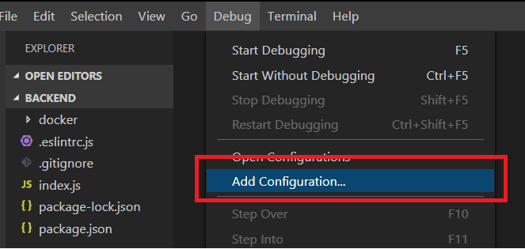
>c. 參照下圖選擇nodejs
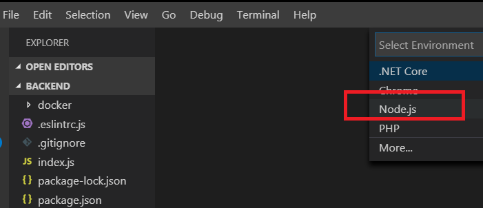
>d. launch.js會長成下圖，這邊有很多可以設定，有需要都可以上網查找
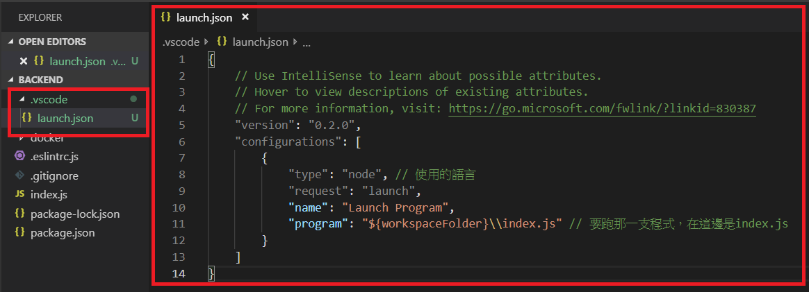
>e. 因為.vscode偏向自己debug，所以在.gitignore裡要再加上.vscode，如下圖:
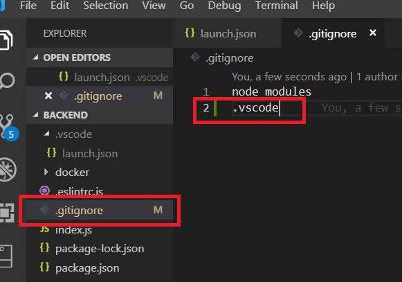
>f. 正在debugging的圖示:
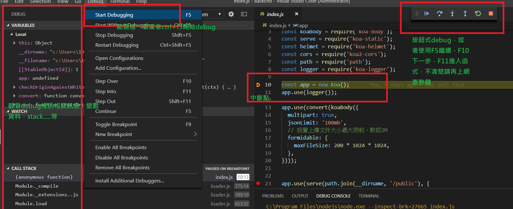

### 6.2. 前端
>a. 於程式中使用console.log

>a. 使用npm run start 開啟webpack dev server模式, 使用瀏覽器F12 console訊息debug

### 6.3. apidoc
參考:
 
簡易介紹:<<a href="https://medium.com/lion-f2e/%E6%92%B0%E5%AF%ABapi%E7%9A%84%E5%88%A9%E5%99%A8-apidoc-8fda7bca944e" target="_blank">簡易說明</a>>,
 
詳細說明:
<<a href="https://apidocjs.com/" target="_blank">official website</a>>

實作:
>a. 在api的相關設定都請參考上面文章
 
>b. 安裝apidoc<pre><code>npm install -g apidoc</code></pre>
>c. 產生apidoc的網頁文件<pre><code>apidoc -i ./src/ -o ./public/apidoc</code></pre>
>d. 使用瀏覽器打開./public/apidoc/index.html即可看到apidoc的網站
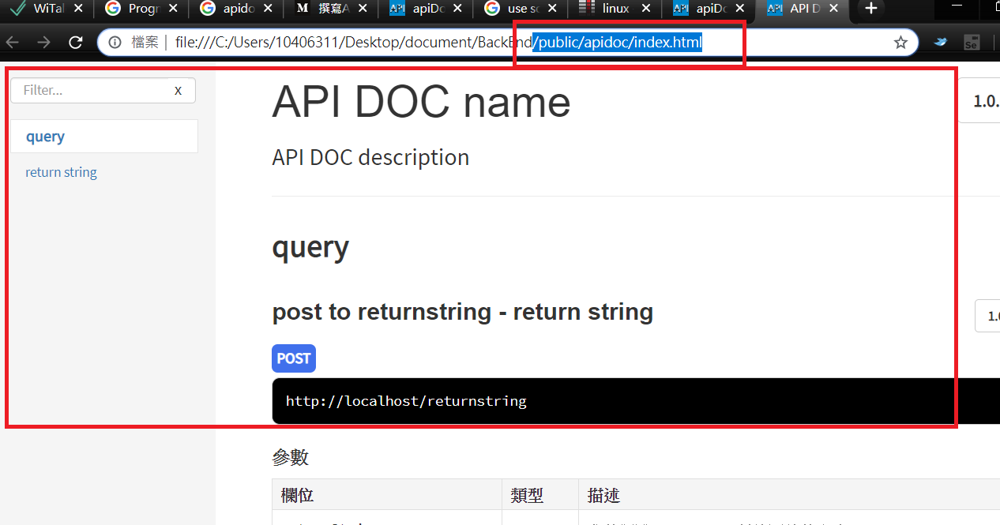
 

## 7. 使用ESLint來管理coding style
參考:
 
ESLint介紹:<<a href="https://larrylu.blog/improve-code-quality-using-eslint-742cf1f384f1"  target="_blank">ESLint教學</a>>，看完教學後，因前後端需求不一，所以底下會分成前後端各自一份:
### 7.1 安裝
使用vs code左邊的extensions，搜尋code左邊的extensions，搜尋eslint，點選第一個，在右邊頁面按安裝，如圖:
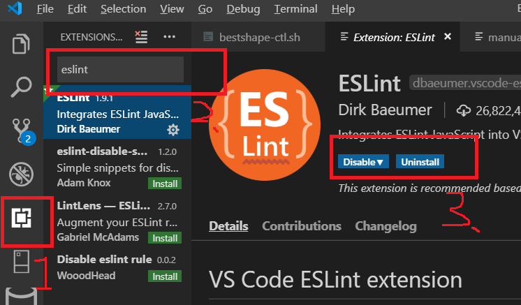
### 7.2 後端 eslint
>a. eslint --init

>b. 根據前後端需求選擇所需要的style，並選擇Airbnb作為default的style

>c. 可以參考此份設定，<a href="./BackEnd/.eslintrc.js" target="_blank">javascript ESLint後端範例</a>
### 7.3 前端eslint
>a. eslint --init

>b. 根據前後端需求選擇所需要的style，並選擇Airbnb作為default的style

>c. npm install babel-eslint eslint-plugin-jsx-control-statements --save-dev

>d. 前端以使用react為例, env請加上commonjs, parser使用babel-eslint, rules加上"react/jsx-filename-extension": [1, { "extensions": [".js", ".jsx"]}]

>e. 可以參考此份設定，<a href="./FrontEnd/.eslintrc.js" target="_blank">javascript ESLint前端範例</a>

 

 

## 8. 請使用docker作為release的工具
參考:
 
<a href="https://larrylu.blog/step-by-step-dockerize-your-app-ecd8940696f4" target="_blank">Docker 教學</a>
 
<a href="https://docs.docker.com/engine/reference/commandline/docker/" target="_blank">Docker 指令</a>
 
<a href="https://docs.docker.com/engine/reference/builder/" target="_blank">Dockerfile的關鍵字教學</a>
 
上述三個網址請至少花三天好好研讀

### 8.1. docker run [OPTIONS] IMAGE[:TAG|@DIGEST] [COMMAND] [ARG...]
>在上面的Docker指令有教學，docker run主要分成兩步，下面舉node:10.17.0-slim來舉例:
>a. sudo docker pull node:10.17.0-slim，這個指令會出現一個問題是docker login，因為docker預設是跟https://hub.docker.com 找尋資源，所以需要docker login之後才可以pull，而login的帳號密碼則得上https://hub.docker.com 這網站註冊完即可
 
>b. <pre><code>sudo docker run node:10.17.0-slim node -v</code></pre>   
>>==> 會顯示v10.17.0

### 8.2. docker build [OPTIONS] PATH | URL | -
>在上面的Docker指令有教學，docker build主要分成兩步，下面舉node:10.17.0-slim來舉例:
 
>a. 我們先選好要用那一個來當base image，這邊一樣採用node:10.17.0-slim，而這一份剛剛上一步已經下載過
 
>b. docker login repo.devpack.cc，請使用OA密碼登入
 
>c. <a href="./BackEnd/docker/Dockerfile" target="_blank">可參考Dockerfile範例</a>
 
>d. cd BackEnd/docker，下底下指令
><pre><code>sudo docker build --no-cache -t repo.devpack.cc/anta_hsiao/document:1.0-xxxxxx -f Dockerfile ../</pre></code>
>指令相關的說明請參考
><pre><code>docker build --help</pre></code>
 
>e. build好後，local端下docker image ls，就會看到下面
 
repo.devpack.cc/anta_hsiao/document      1.0-xxxxxx          21014e6c3df1        6 seconds ago       148MB
 
>f. 範例如下: 
><pre><code>docker run repo.devpack.cc/anta_hsiao/document:1.0-xxxxxx</code></pre>
>==> 會顯示http server listening at port: 80

>g. 如果是預期的結果，可以將image push回公司的repo.devpack.cc，兩個步驟如下:
 
>g.1 上tag
><pre><code>sudo docker tag repo.devpack.cc/anta_hsiao/document:1.0-xxxxxx repo.devpack.cc/anta_hsiao/document:latest</code></pre>
>g.2 push
><pre><code>sudo docker push repo.devpack.cc/anta_hsiao/document:latest</code></pre>
>g.3. 點選下圖位置，可以看到上傳image跟版本號相關訊息
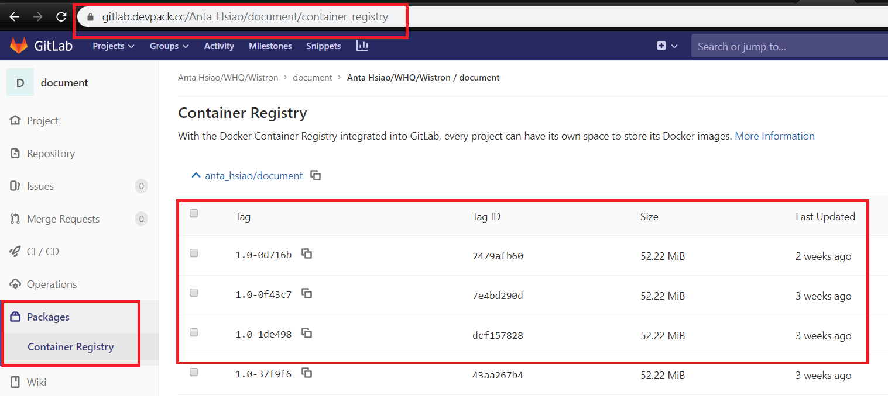

備註: 如果每次build都是同一個人，那以上步驟沒有問題，但如果是持續性結合git的depoly(俗稱CD)，那就得用tag來控管這些image的版本，那怕有一天需要緊急降版這個後面在一併說明。

 

## 9. nexe(非必須，視專案用途)
參考:<a href="https://github.com/nexe/nexe" target="_blank">nexe</a>
>說明:
>因javascript是直譯語言，所以執行時，並不用編譯過，所以程式碼都會是明碼，
>   nexe是一個將javascript打包且混淆程式碼的工具，才不會將程式邏輯都洩漏出去。

## 10. unit test
參考:
 
<a href="https://medium.com/@ji3g4kami/unit-test-%E6%95%99%E5%AD%B8-ba39e54fcbc5" target="_blank">什麼是unit test</a>

### 10.1 後端 unit test
參考: 
使用<a href="https://codeburst.io/lets-build-a-rest-api-with-koa-js-and-test-with-jest-2634c14394d3" target="_blank">jest+supertest</a>來達到RestFul API的unit test
>a. 請用visual studio code使用BackEnd當根目錄打開 

>b. 先安裝jest跟supertest(npm install jest supertest)

>c. 在package.json裡的script加入"test": "jest --coverage"

>d. 因為jest會自動掃描test.js的檔案來跑，所以在這邊我們建了一個__tests__資料夾，裡面放了一個<a href="./__test__/routes.test.js" target="_blank">routes.test.js</a>，這裡面有一些細項說明，為什麼要這樣測...等

>e. 在終端機下npm run test，會出現涵蓋率...等

>f. 如果人力許可，時間壓力許可，unit test盡量跟開發人員分開，比如A寫功能，B寫測試

### 10.2 前端 unit test

## 11. auto test(待補 maybe selenium)
## 12. 結合git、docker、unit test、auto test來做CI/CD

### 12.1. gitlab-runner

參考:<a href="https://docs.gitlab.com/runner/" target="_blank">gitlab-runner doc</a>

>a. 如果你有VM沒安裝過gitlab-runner，則參照<a href="https://docs.gitlab.com/runner/install/linux-repository.html" target="_blank">gitlab-runner install</a>，如果沒有VM，則就看天安排要去那一台跑了，請跳c

>b. 如果你做完a，參照<a href="https://docs.gitlab.com/runner/register/index.html" target="_blank">gitlab-runner register</a>註gitlab-runner，因為權限問題，所以建議將gitlab-runner預設為用root跑，相對問題會少很多，如下:
><pre><code>yum install -y gitlab-runner
>gitlab-runner uninstall
>gitlab-runner install --working-directory /home/gitlab-runner/ --user root
>service gitlab-runner restart</code></pre>

>c. 到這步驟至少有一台gitlab-runner可以使用，請善用tag來trigger你要的gitlab-runner跑CI/CD

### 12.2. .gitlab-ci.yml
參考:此網站<a href="https://docs.gitlab.com/ee/ci/" target="_blank">gitlab CI/CD</a>內容有點多，可以先專注在stage上，進階可以再找時間研讀。

#### 前置作業 :
請點選<a href="./.gitlab-ci.yml" target="_blank">gitlab-ci.yml</a>，這邊是一個很簡單的例子，
分成四個stage，然而每個stage都會需要npm install，所以在這邊多加了一個cache的機制來安裝node_module，
然後將node_module往後面的stage帶過去，而為了這個機制我們也在before_script增加了把前後端的node_module移除重新安裝的指令，如下:
<pre><code>sudo rm -rf ./BackEnd/node_modules
sudo rm -rf ./FrontEnd/node_modules
sudo docker run --rm -v `pwd`/BackEnd:/myapp -t node:10.17.0-slim sh -x -c 'cd /myapp && npm install'
sudo docker run --rm -v `pwd`/FrontEnd:/myapp -t node:10.17.0-slim sh -x -c 'cd /myapp && npm install'
</code></pre>

#### stage說明如下 :
#### a. 第一個是test stage，command如下:
<pre><code>sudo docker run --rm -v `pwd`/BackEnd:/myapp -t node:10.17.0-slim sh -x -c 'cd /myapp && npm run test</code></pre>
起了一個docker來跑npm run test。

#### b. 第二個stage是buildfrontend，command如下:
<pre><code>
sudo docker run --rm -v `pwd`:/myapp -t node:10.17.0-slim sh -x -c 'cd /myapp/FrontEnd && npm run build && mkdir -p ../BackEnd/public/web && cp -rf ./dist/*.* ../BackEnd/public/web'</code></pre>
起了一個docker，然後跳到FrontEnd資料夾先build好前端，再複製到後端的public folder。

#### c. 第三個stage是apidoc，command如下:
<pre><code>
sudo docker run --rm -v `pwd`/BackEnd:/myapp -t node:10.17.0-slim sh -x -c 'cd /myapp && npm install apidoc -g && apidoc -i ./src/ -o ./public/apidoc'</code></pre>
起了一個docker，然後build apidoc的檔案。

#### d. 第四個stage是run，command如下:
<pre><code>
sudo docker run --rm -p 80:80 -v `pwd`/BackEnd:/myapp -t node:10.17.0-slim sh -x -c 'cd /myapp && npm install &&  node -v && node index.js'</code></pre>
起了一個docker，然後叫起後端的服務，<a href="http://10.31.50.66/apidoc/index.html" target="_blank">apidoc web</a>

##### b.2. docker build, 指令: make docker-build -C ./BackEnd/docker，指令說明如下:
>跑BackEnd資料夾裡的docker資料夾裡的Makefile檔案中的docker-builed

>example: 
><pre><code>sudo docker build --no-cache -t repo.devpack.cc/anta_hsiao/document:1.0-a9ijdk -f Dockerfile ../</code></pre>
>說明: 1.0-a9ijdk means 1.0版本號，a9ijdk是commit亂序的前六碼
##### b.3. push docker image:
>語法:
><pre><code>sudo docker tag repo.devpack.cc/anta_hsiao/document:1.0-a9ijdk repo.devpack.cc/anta_hsiao/document:latest</code></pre>

>上面這一行是上tag

><pre><code>sudo docker push repo.devpack.cc/anta_hsiao/document:1.0-a9ijdk && sudo docker push repo.devpack.cc/anta_hsiao/document:latest
</code></pre>

>上面這行是因為每一次release都是最新的，但有時候需要回朔的時候，我們要可以找的要回朔的版本，所以要push兩個版本上去

##### b.4. 到別的機器run docker image: 
>pull image
><pre><code>docker pull repo.devpack.cc/anta_hsiao/document:latest</code></pre>
>run image
><pre><code>docker run repo.devpack.cc/anta_hsiao/document:latest</code></pre>  
>上面舉的是最簡單的例子，會印出一句http server listening at port: 80

>## 13. typescript & typeorm
### 13.1 typescript
參考:此網站<a href="https://willh.gitbook.io/typescript-tutorial/" target="_blank">typescript教學</a>
補充說明: 如果javascript很熟，這邊可以翻翻就好
### 13.2 typeorm
參考:此網站<a href="https://typeorm.io/#/" target="_blank">typeorm教學</a>
請多利用練習，好好練習typeorm，左邊的Connection、Entity、Relations、Entity Manager and Repository、Query Builder， 
請務必練習到熟練
(注意: 當orm不好組語法時，還是可以寫純的sql，但資料得自己整理)
### 13.3 開始寫作業囉
用vscode開啟typescript_typeorm
### 13.4 api document
請將docs裡的題目.yaml丟到https://editor.swagger.io/
題目.yaml算是比較完整的api swagger的寫法，請將他細分成album.yaml song.yaml singer.yaml 
有些共通的 在看個人要怎麼分 api document主要是讓前後端有個依據
### 13.5 Joi檢查body欄位跟資料型別
參考getAlbum這支api
### 13.6 migration
migration 會參考entity自動產生修改或新增資料表的sql，對於CI/CD有很大的幫助，不用每次都手動，
但有一個很重要的前提是，對於資料庫的操作，盡量都要用migration來做

